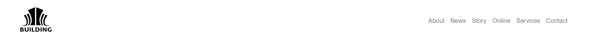
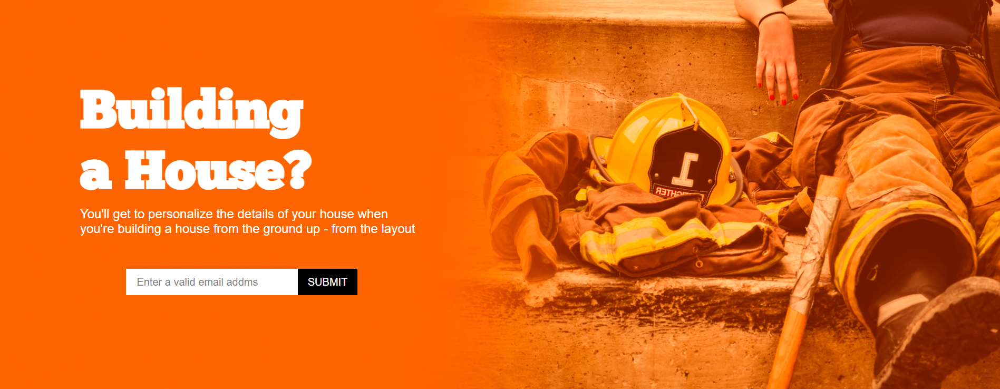
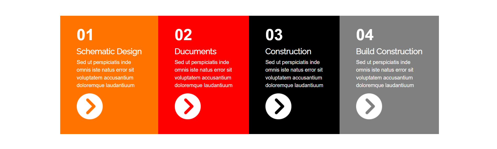
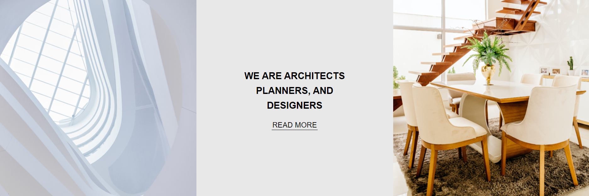
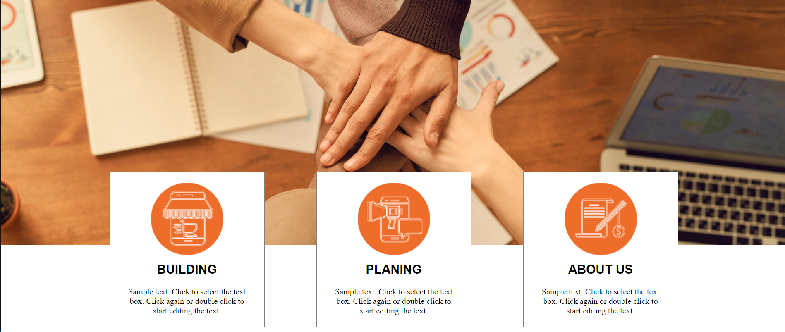

# RWD_1

## 響應式網頁設計

規劃斷點：768 / 1200 / 1200以上

CSS：以桌機(1200以上)優先，再寫平板(768 ~ 1200)與手機(768以下)的效果。

## 畫面展示

### 桌機畫面展示 - 1200以上

### 平板畫面展示 - 768 ~ 1200

### 手機畫面展示 -768以下

## 結構

### header

公司Logo & 選單

### section

大圖跟搜尋欄

### nav

色塊連結

### article top

凸顯文字區塊 & 搜尋更多的連結

### article middle

6格圖與色塊展示

### article buttom

3格文字與圖片展示

### footer

色塊與簡單陳述

